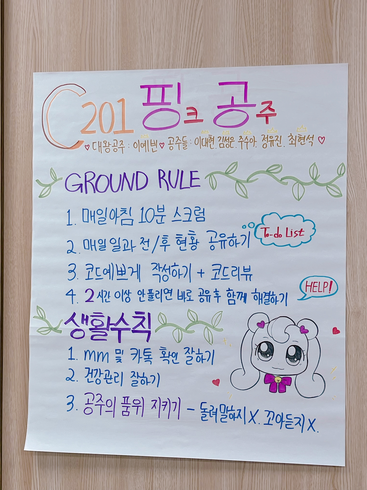
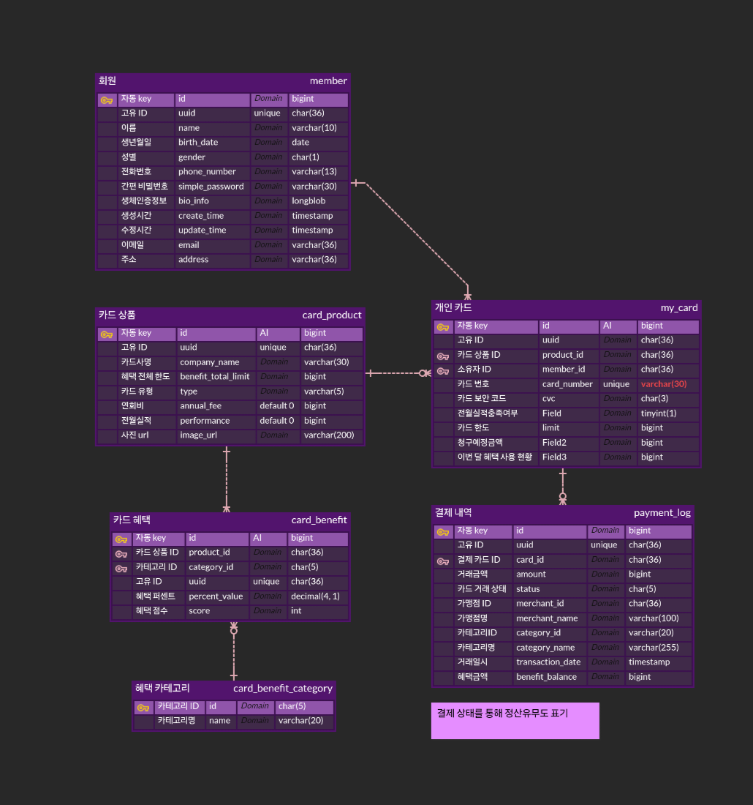
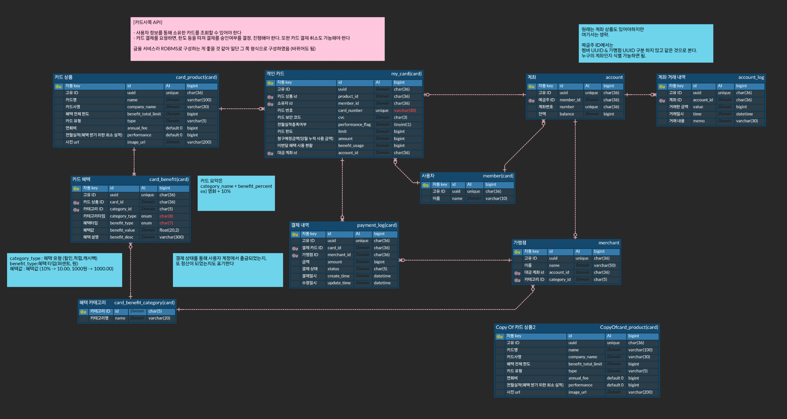
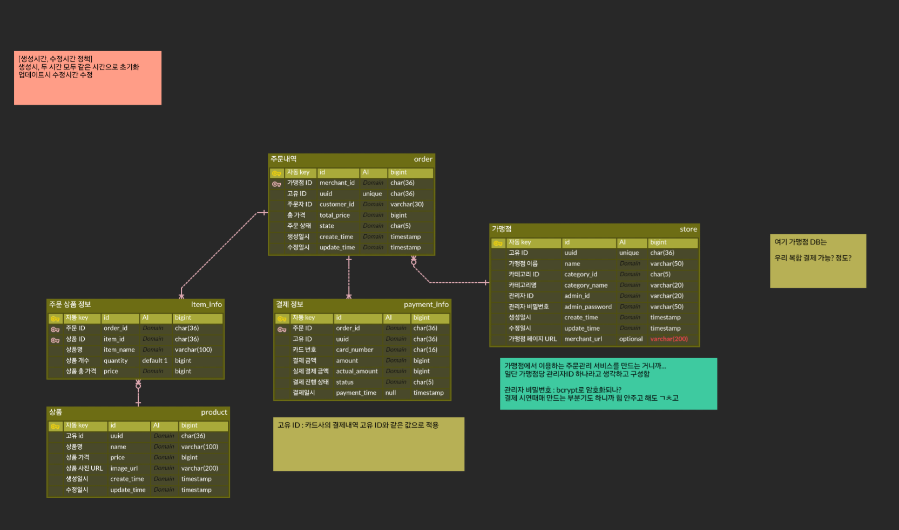
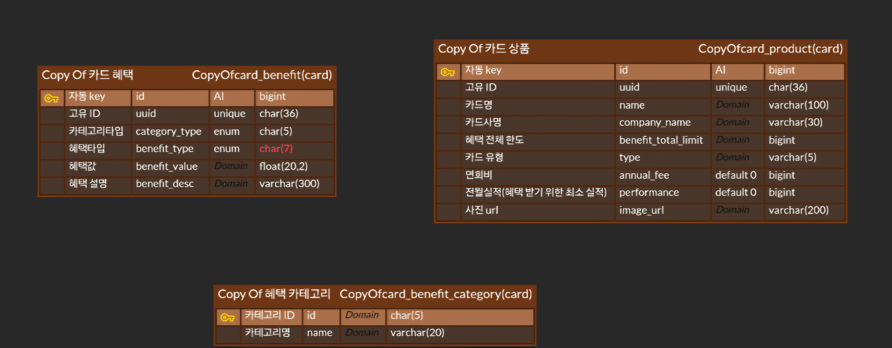
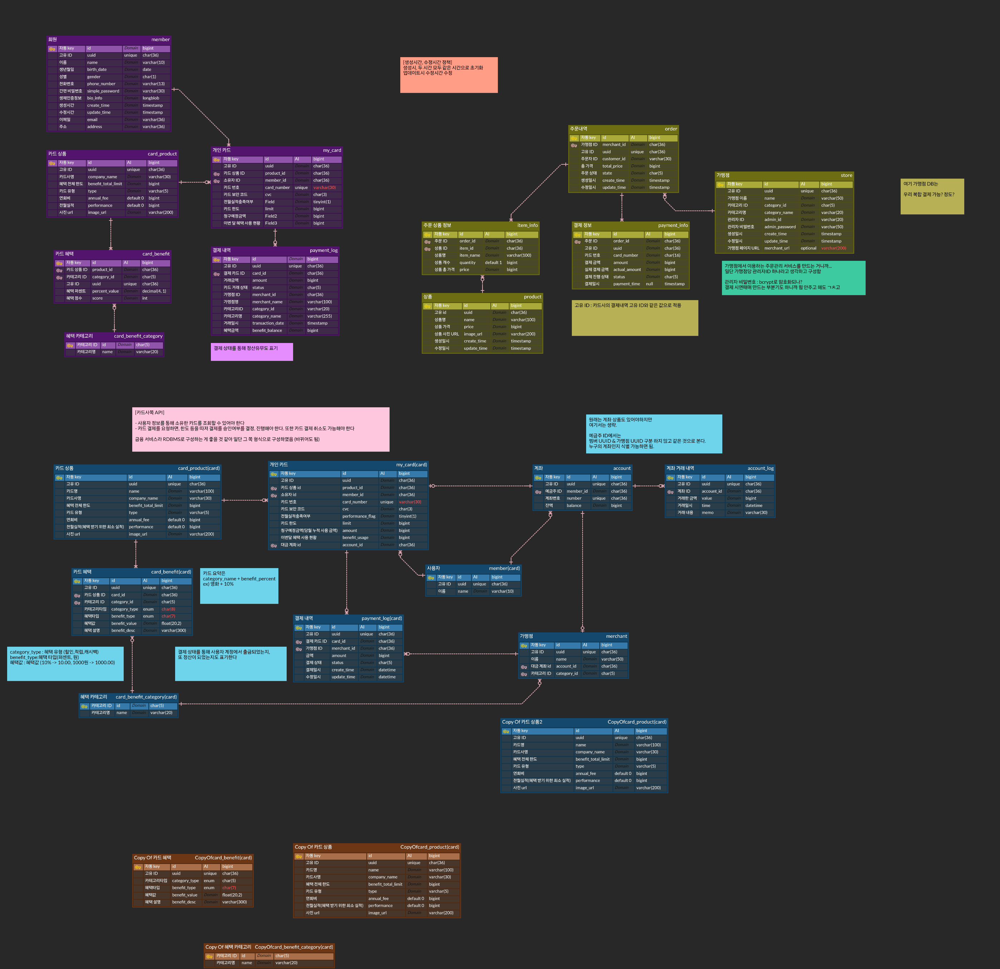

# MoA Pay

## 🏆삼성 청년 SW아카데미(SSAFY) 11th 특화프로젝트 🏆

## ✅ 프로젝트 진행 기간

2023.08.19 ~ 2023.10.11

## ✅ 팀 모토 및 그라운드룰 사진

  

## ✅ 멤버소개

  

## ✅ 기술스택

## :pushpin: 기술 스택

<table>
    <tr>
        <td><b>Back-end</b></td>
        <td>

 

 

</td>
    </tr>
    <tr>
    <td><b>Front-end</b></td>
    <td>

    </td>
    </tr>
    <tr>
    <td><b>Infra</b></td>
    <td>

</td>
    <tr>
    <td><b>Tools</b></td>
    <td>
    
    

    </td>
    </tr>
</table>

## ✅ 시스템 아키텍쳐

## ✅ 프로젝트 소개

**🚩 서비스 한줄 소개**

자동으로 실적을 채우고 최대의 혜택을 받을 수 있는 페이 서비스

**기획의도 및 배경**

현대인들은 여러 장의 신용카드나 체크카드를 사용하지만, 각 카드가 제공하는 혜택을 매번 기억하기 어렵고, 이로 인해 혜택을 효율적으로 활용하지 못하는 경우가 많다.
또한, 혜택을 받기 위한 실적이 얼마나 달성되었는지 직관적으로 파악하거나 채우는데에 어려운 점도 문제로 지적되고 있다. 이러한 불편함을 해결하고자, 실적을 자동으로 채워 관리하고 그를 기반으로 혜택을 받을 수 있는 솔루션을 기획하게 되었다.

**[문제제기 1]**
카드마다 여러 혜택이 존재하는데 혜택의 존재를 알지 못해 사용하지 못하는 사람이 존재한다.

**[문제제기 2]**
카드마다 채워야하는 실적이 다르고 이를 전부 채우기 위해선 오프라인에선 금액을 나눠 결제를 해야하고
온라인의 경우 나눠 결제도 불가능해 실적 채우는데 어려움이 존재한다.

**[솔루션 도출]**
사용자는 회원가입 시 결제 시 혜택 우선인지 결제 우선인지 선택하게된다.
이를 기반으로 자동 추천 결제를 통해
실적 우선인 경우 채우지 못한 실적을 채우도록 카드를 선택해 분할 결제를 진행하고

▪️**서비스 목적**

▪️**서비스 목표**

▪️**기대효과**

1. 효율적인 소비
2. 편리한 카드 결제와 실적 관리

## ✅ 기능 소개

### 로그인, 회원 가입

<table>    
    <tr align="center"> 
        <td><strong> 초기 화면 </strong></td>
        <td><strong> 회원 가입</strong></td>
    </tr>
    <tr align="center"> 
        <td>  </td>
        <td>  </td>
    </tr>
    <tr> 
        <td>
            1. 앱 실행 시 로그인 및 회원가입 진행 가능  
        </td>
        <td>
            1. 이름, 주민 번호, 통신사, 핸드폰 번호 입력 
            2. 수신 받은 인증번호를 통해 회원 가입 진행
        </td>
    </tr>
    <tr align="center"> 
        <td><strong>간편 비밀번호</strong></td>
        <td><strong>지문 등록</strong></td>
    </tr>
    <tr align="center"> 
        <td>  </td>
        <td>  </td>
    </tr>
    <tr> 
        <td >
            1. 간편 비밀번호 등록 가능 
            2. 재확인을 통해 오입력, 실수 방지
        </td>
        <td>
            1. 보안성 강화를 위한 지문 등록 
            2. 건너뛰기를 통해 지문 인식 넘기기 가능  
        </td>
    </tr>
</table>

### 카드 불러오기, 추천 타입

<table>    
    <tr align="center" > 
        <td><strong>카드 불러오기</strong></td>
        <td><strong>결제 우선 순위 설정</strong></td>
    </tr>
    <tr align="center"> 
        <td>  </td>
        <td>  </td>
    </tr>
    <tr> 
        <td>
             
        </td>
        <td>
            
        </td>
</table>

### 메인화면

<table>    
    <tr align="center" > 
        <td><strong>메인 화면</strong></td>
    </tr>
    <tr align="center"> 
        <td>  </td>
    </tr>
    <tr> 
        <td>
             
             
        </td>
</table>

### 온라인 결제

<table>    
    <tr align="center" > 
        <td><strong>바코드 잠금, 지문 인식 설정</strong></td>
        <td><strong>최종 결제</strong></td>
    </tr>
    <tr align="center">
        <td>  </td>
        <td>  </td>
    </tr>
    <tr> 
        <td>
           
        </td>
        <td>
           
        </td>
</table>
<table>
  <tr align="center">
    <td><strong>결제 준비</strong></td>
    <td><strong>결제 후</strong></td>
  </tr>
  <tr>
    <td></td>
    <td></td>
  </tr>
  <tr>
    <td>
       
    </td>
    <td>
       
    </td> 
  </tr>
</table>

### 카드

<table>    
    <tr align="center" > 
        <td><strong>카드 세부 정보 조회</strong></td>
        <td><strong>.</strong></td>
    </tr>
    <tr align="center">
        <td>  </td>
        <td>  </td>
    </tr>
    <tr> 
        <td>
             
        </td>
        <td>
          
        </td>
    <tr align="center" > 
        <td><strong>카드 세부 정보 조회</strong></td>
        <td><strong>카드 세부 정보 조회</strong></td>
    </tr>
    <tr align="center">
        <td>  </td>
        <td>  </td>
    </tr>
    <tr> 
        <td>
             
        </td>
        <td>
             
        </td>
</table>

### 통계

<table>    
    <tr align="center" > 
        <td><strong>이번 달 할인 내역, 이용내역</strong></td>
        <td><strong>내 소비, 혜택</strong></td>
    </tr>
    <tr align="center">
        <td>  </td>
        <td>  </td>
    </tr>
    <tr> 
        <td>
           
        </td>
        <td>
             
        </td>
</table>

### 마이페이지

<table>    
    <tr align="center" > 
        <td><strong>바코드 잠금, 지문 인식 설정</strong></td>
    </tr>
    <tr align="center">
        <td>  </td>
    </tr>
    <tr> 
        <td>
         
        </td>
        <td>
           
        </td>
        <td>
        </td>
</table>

## ✅ 활용기술, 기술 설명

### 생체인증

## ✅ 산출물(ERD, 명세서, 파일구조)

### ERD 

    
    

### 명세서

- **요구사항, 기능 명세서**

- **API 명세서**

## ✅ 결과공유, 느낀점(모두작성)

#### 이예빈

#### 정유진

#### 김성은

#### 최현석

#### 이대현

#### 주수아

## ✅ UCC링크

[MoA Pay Ucc](https://youtu.be/GBB3lD6g-10?feature=shared)
