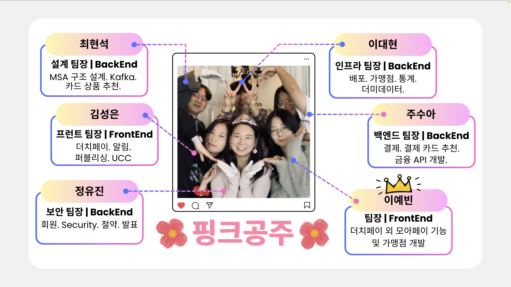
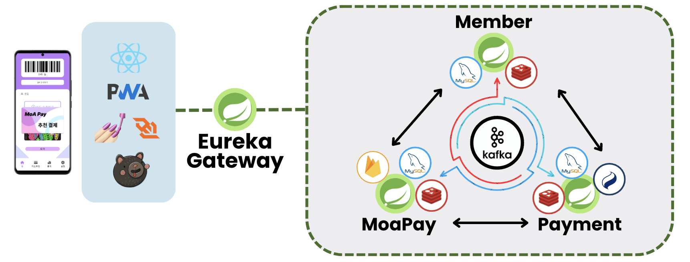
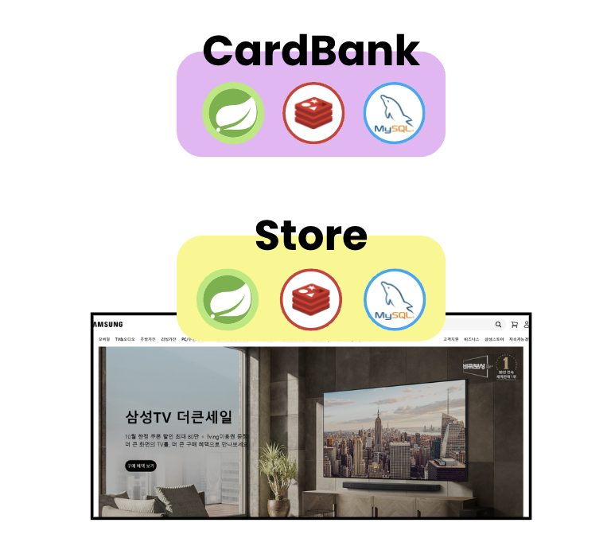
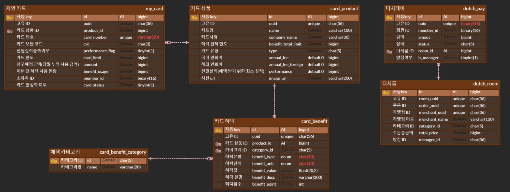
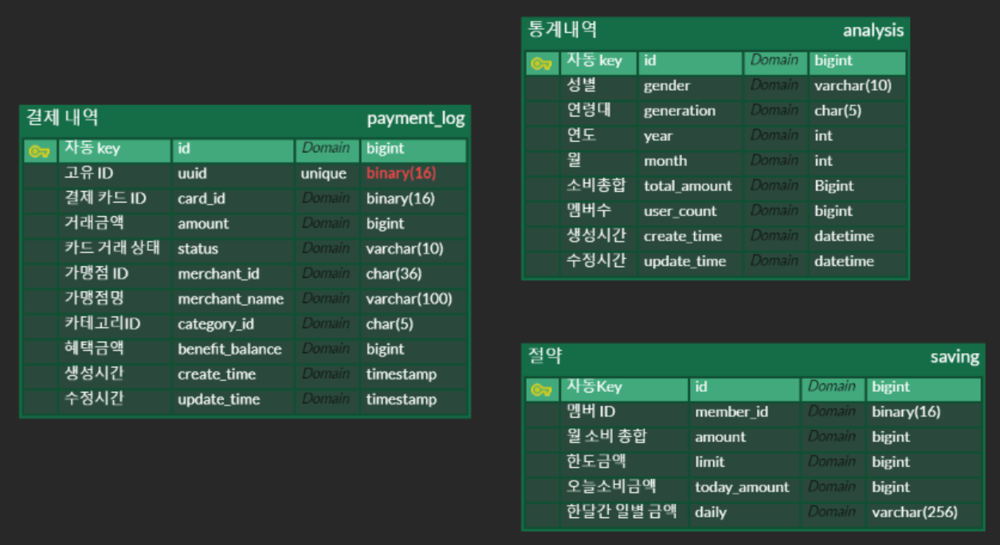
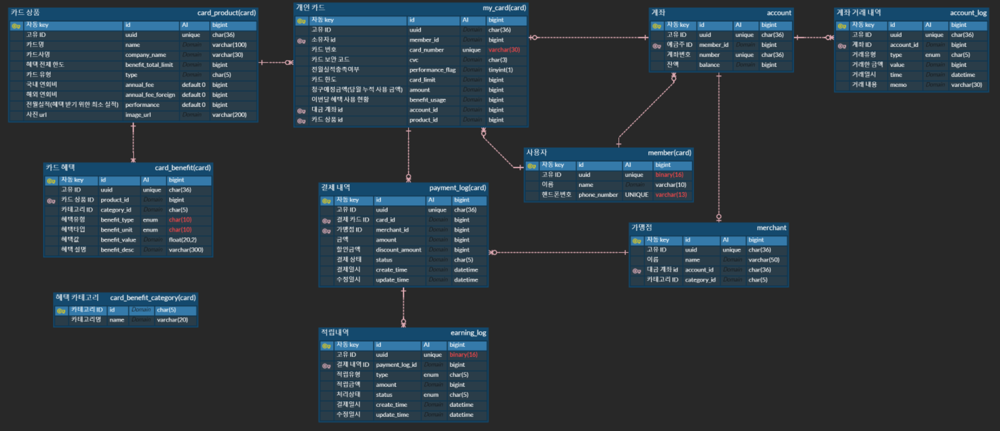
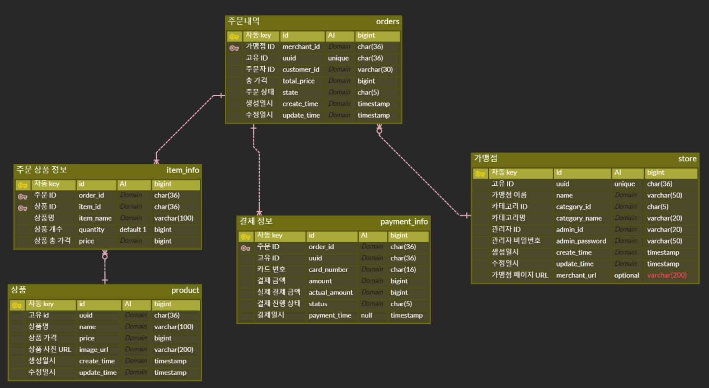
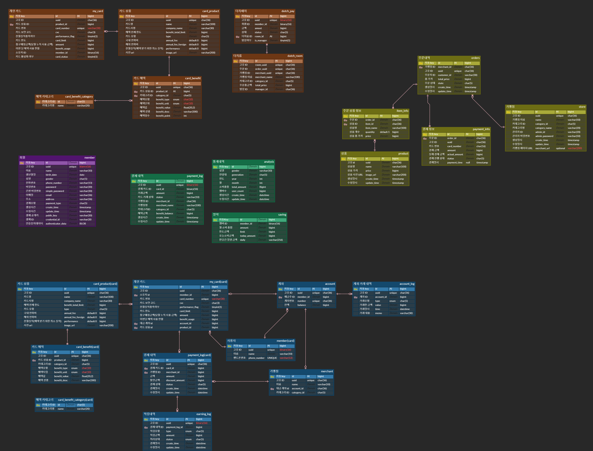

# MoA Pay

## 🏆삼성 청년 SW아카데미(SSAFY) 11th 특화프로젝트 🏆

  

## 📆 프로젝트 진행 기간

2023.08.19 ~ 2023.10.11 (8주)

## 🗿 팀 모토 및 그라운드룰 사진

  

## 🫂 멤버소개

  

## 🤸‍♂️ 기술스택

<table>
    <tr>
        <td><b>Back-end</b></td>
        <td>

 

 

</td>
    </tr>
    <tr>
    <td><b>Front-end</b></td>
    <td>

    </td>
    </tr>
    <tr>
    <td><b>Infra</b></td>
    <td>

</td>
    <tr>
    <td><b>Tools</b></td>
    <td>
    
    

    </td>
    </tr>
</table>

## 🛠️ 시스템 아키텍쳐

### MoA PaY

### CARDBANK, STORE

## 💳 프로젝트 소개

### 🚩 서비스 한줄 소개

자동으로 실적을 채우고 최대의 혜택을 받을 수 있는 페이 서비스

 

### 기획의도 및 배경

현대인들은 여러 장의 신용카드나 체크카드를 사용하지만, 각 카드가 제공하는 혜택을 매번 기억하기 어렵고, 이로 인해 혜택을 효율적으로 활용하지 못하는 경우가 많다. 
또한, 혜택을 받기 위한 실적이 얼마나 달성되었는지 직관적으로 파악하거나 채우는데에 어려운 점도 문제로 지적되고 있다.  이러한 불편함을 해결하고자, 실적을 자동으로 채워 관리하고 그를 기반으로 혜택을 받을 수 있는 솔루션을 기획하게 되었다.

 

### 문제제기

**[문제제기 1]**

카드마다 여러 혜택이 존재하는데 혜택의 존재를 알지 못해 사용하지 못하는 사람이 존재한다.

**[문제제기 2]**

카드마다 채워야하는 실적이 다르고 이를 전부 채우기 위해선  오프라인에선 금액을 나눠 결제를 해야하고
온라인의 경우 나눠 결제도 불가능해 실적 채우는데 어려움이 존재한다.

 
 

### 솔루션 도출

사용자는 회원가입 시 결제 시 혜택 우선인지 결제 우선인지 선택하게된다. 
이를 기반으로 자동 추천 결제를 통해
실적 우선인 경우 채우지 못한 실적을 채우도록 카드를 선택해 분할 결제를 진행하고 
혜택 우선인 경우 결제의 카테고리를 분류해 해당 카테고리의 혜택을 가장 많이 제공하는 카드를 선택해 분할 결제를 진행한다.

 
 

### 서비스 목적

이 서비스의 목적은 사용자가 여러 신용카드나 체크카드를 효율적으로 관리할 수 있도록 돕는다. 
각 카드의 혜택을 최대한 활용하고, 실적 관리의 번거로움을 해결하여 사용자가 최적의 결제 방식을 선택할 수 있도록 지원한다.

 
 

### 기대효과

1. 효율적인 소비: 사용자는 카드 혜택을 효율적으로 활용하고, 실적을 자동으로 관리하여 불필요한 지출을 줄일 수 있습니다.
2. 편리한 카드 결제와 실적 관리: 복잡한 카드 실적 관리와 분할 결제를 자동화함으로써 결제 과정이 간편해지고, 사용자가 혜택을 놓치지 않고 활용할 수 있습니다.
3. 시간 절약: 실적 관리에 대한 걱정을 덜고, 자동화된 추천 시스템을 통해 사용자는 빠르고 효율적으로 결제할 수 있습니다.

 
 

## ✅ 기능 소개

### 로그인, 회원 가입

<table>    
    <tr align="center"> 
        <td><strong> 초기 화면 </strong></td>
        <td><strong> 회원 가입</strong></td>
    </tr>
    <tr align="center"> 
        <td>  </td>
        <td>  </td>
    </tr>
    <tr> 
        <td>
            1. 앱 실행 시 로그인이 안되어있을 경우 본인인증 진행  
            2. 이름, 주민 번호, 통신사, 핸드폰 번호 입력 후  
             수신받은 인증번호로 본인인증 진행 
            3. 계정이 있는 경우 간편비밀번호 로그인으로   계정이 없는 경우 회원가입으로 이동
        </td>
        <td>
            1. 이메일, 주소를 입력 후 회원가입 미입력해도 가입 가능
        </td>
    </tr>
    <tr align="center"> 
        <td><strong>간편 비밀번호</strong></td>
        <td><strong>지문 등록</strong></td>
    </tr>
    <tr align="center"> 
        <td>  </td>
        <td>  </td>
    </tr>
    <tr> 
        <td >
            1. 간편 비밀번호 등록 
            2. 재확인을 통해 오입력, 실수 방지 
            3. 보안성 강화를 위한 보안 키패드
        </td>
        <td>
            1. 보안성 강화를 위한 지문 등록 
            2. 건너뛰기를 통해 지문 인식 넘기기 가능  
        </td>
    </tr>
</table>

### 카드 불러오기, 추천 타입

<table>    
    <tr align="center" > 
        <td><strong>카드 불러오기</strong></td>
        <td><strong>결제 우선 순위 설정</strong></td>
    </tr>
    <tr align="center"> 
        <td>  </td>
        <td>  </td>
    </tr>
    <tr> 
        <td>
            1. 카드사에 등록된 카드를 불러와 등록 
            2. 사용하지않을 카드는 삭제 가능
        </td>
        <td>
           1. 결제 시 실적을 우선으로 채울지 
           혜택을 최대한으로 받을지 선택
        </td>
</table>

### 메인화면

<table>    
    <tr align="center" > 
        <td><strong>메인 화면</strong></td>
    </tr>
    <tr align="center"> 
        <td>  </td>
    </tr>
    <tr> 
        <td>
            1. 카드 리스트를 슬라이드 시  오프라인 결제가 가능한 바코드 생성
        </td>
</table>

### 분할결제

<table>
  <tr align="center">
    <td><strong>결제 준비 - 결세수단 결정</strong></td>
    <td><strong>결제 준비 - 결제인증</strong></td>
  </tr>
  <tr>
    <td></td>
    <td></td>
  </tr>
  <tr>
    <td>
     1. 가맹점 사이트에서 결제 QR을  모아페이에서 인식 
     2. 결제 방식 중 분할 결제 클릭
    </td>
    <td>
      1. 결제를 위한 인증 과정 수행 방식 : 간단 비밀번호 or 생체인증
    </td> 
  </tr>
</table>
<table>    
    <tr align="center" > 
        <td><strong>결제 진행 및 결과</strong></td>
    </tr>
    <tr align="center">
        <td>  </td>
    </tr>
    <tr> 
        <td>
          1. 결제 인증 후 결제가 진행 
          2. 사용자는 결과창에서 어떤 카드가 결제에 사용되었고,  얼마의 혜택을 받고 얼마의 실적이 쌓였는지 확인 가능
        </td>
</table>

### 더치페이

<table>
  <tr align="center">
    <td><strong>결제 준비 - 결세수단 결정</strong></td>
    <td><strong>더치페이 준비</strong></td>
  </tr>
  <tr>
    <td></td>
    <td></td>
  </tr>
  <tr>
    <td>
     1. 가맹점 사이트에서 결제 QR을  모아페이에서 인식 
     2. 결제 방식 중 더치페이 클릭
    </td>
    <td>
      1. 더치페이 참가 인원 설정 
      2. 더치페이 공유 링크를 참가자에게 공유 
      3. 더치페이 시작 클릭
    </td> 
  </tr>
</table>
<table>    
    <tr align="center" > 
        <td><strong>결제 진행 및 결과</strong></td>
    </tr>
    <tr align="center">
        <td>  </td>
    </tr>
    <tr> 
        <td>
          1. 결제 카드 선택 후 개인에게 할당된 금액 결제 진헹 
          2. 더치페이 현황 페이지를 통해 결제 진행사항을 확인 가능
        </td>
</table>

### 카드

<table>    
    <tr align="center" > 
        <td><strong>카드 세부 정보 조회</strong></td>
    </tr>
    <tr align="center">
        <td>  </td>
    </tr>
    <tr> 
        <td>
            1. 홈 화면에서 카드를 클릭 시 월마다 결제 내역 확인 가능
        </td>
</table>

### 통계

<table>    
    <tr align="center" > 
        <td><strong>월 별 소비 내역</strong></td>
        <td><strong>월 별 받은 혜택 내역</strong></td>
    </tr>
    <tr align="center">
        <td>  </td>
        <td>  </td>
    </tr>
    <tr> 
        <td>
          1. 월 별 소비한 내역을 카테고리별로 확인 가능 
        </td>
        <td>
            1. 월 별 받은 혜택을 카테고리별로 확인 가능 
        </td>
</table>
<table>    
    <tr align="center" > 
        <td><strong>통계</strong></td>
        <td><strong>소비 절감 챌린지</strong></td>
    </tr>
    <tr align="center">
        <td>  </td>
        <td>  </td>
    </tr>
    <tr> 
        <td>
          1. 같은 성별, 또래에 비해 저번 달에 얼마나 소비를 얼마나 덜/더 했는지 정보 제공 
          2. 1년 치 소비/혜택 그래프 제공
        </td>
        <td>
          1. 이번 달 목표 소비 금액 설정 
          2. 사용 금액 / 목표를 달성하기 위해   하루 사용가능한 금액 제공 
          3. 주차별 사용 금액과 하루 평균 사용 금액 정보 제공 
          4. 매일 사용 금액을 그래프로 제공 
        </td>
</table>

## ⚒️ 활용기술, 기술 설명

### 생체 정보 등록 및 인증

WebAuthn API를 활용해 진행 

**생체정보 등록** 
클라이언트에서 새로운 생체 정보를 등록하기 위한 요청을 보내고 서버로부터 등록에 필요한 옵션 데이터를 받아옵니다. 
받은 옵션 데이터를 바탕으로 navigator.credentials.create() API를 호출하여 실제 생체 정보 등록을 시작합니다.
 이 과정에서 사용자의 생체 정보를 기반으로 키 쌍이 생성되는데 생성된 생체 인증 데이터를 서버에 전송하여 등록을 완료합니다.  이때 서버는 사용자 인증 데이터를 검증하고, 성공 시 해당 정보를 저장하여 추후 인증에 사용할 수 있도록 합니다.

**생체 인증** 
클라이언트에서 생체 인증을 요청할 때, 서버로부터 인증 옵션 데이터를 받습니다. 받은 옵션 데이터를 바탕으로 navigator.credentials.get() API를 호출하여 사용자 생체 인증을 시작합니다. 이때 서버에서 제공한 옵션을 사용하여 사용자 정보를 검증합니다.  인증 결과 데이터를 서버로 전송하여 사용자 인증을 완료합니다.  서버는 이 데이터를 검증한 후, 성공적인 경우 안증 완료 처리합니다.

## 📕 산출물(ERD, 명세서, 파일구조)

### ERD

### 명세서

[API 명세서](https://docs.google.com/spreadsheets/d/1CjcQ9EE2V08nea62A1RsqoH-0oQzRCKgm-9PH1YaQ3M/edit?usp=sharing)

## 💸 결과공유, 느낀점(모두작성)

**이예빈**

모아페이 프로젝트는 저에게 있어서 낯설었던 핀테크에 한발자국 다가갈 수 있는 경험이 되었습니다. 
또한 webAuthn, QRcode 등 활용해 기존에 구현해보지않았던 기능 개발을 담당하여 배워가는게 많았던 프로젝트였습니다. 
허나 통합 페이 플랫폼으로 다양한 기능을 유저에게 제공하고싶다는 마음이 컸기에
수면시간을 줄이면서 진행해  원하던 기능은 대부분 구현했지만 시간이 많이 제한되어있어 원했던 만큼의 퀄리티는 나오지 못한 것이 아쉬웠습니다.

**최현석**

새로운 페이 애플리케이션을 개발하면서 새로운 기술들을 많이 습득할 수 있는 계기가 되었던 것 같습니다. 특히 MSA를 처음 도입하는 과정에서 이런저런 시도를 많이 해본 게 좋은 경험이었던 것 같습니다. 또 팀원들과 함께 고생하면서 프로젝트를 진행한 것은 소중한 경험이 되었습니다.

**주수아**

이번 프로젝트를 통해, 이전에는 잘 알지 못했던 핀테크의 개념을 이해하고 직접 구현하는 값진 경험을 해볼 수 있었습니다. 특히 오프라인-온라인을 아우르는 카드 결제 서비스의 프로세스를 이해하고, 처음부터 끝까지 구현해본 것이 이번 프로젝트에 얻은 가장 값진 경험인 것 같습니다.  
또, MSA를 구성해 Kafka를 통한 서비스간 상호작용을 구현해본 점, RestClient와 Kafka 중 어떤 것을 이용해 서비스간 통신을 이루어낼지 고민해본 것도 좋은 경험이었던 것 같습니다.  
8주라는 긴 시간동안 열심히 달려와준 모든 프로젝트 멤버에게 큰 고마움을 느끼고 있습니다. 다들 감사합니다!

**정유진**

**김성은**

**이대현**

## 🎬 UCC링크

[MoA Pay Ucc](https://youtu.be/GBB3lD6g-10?feature=shared)
